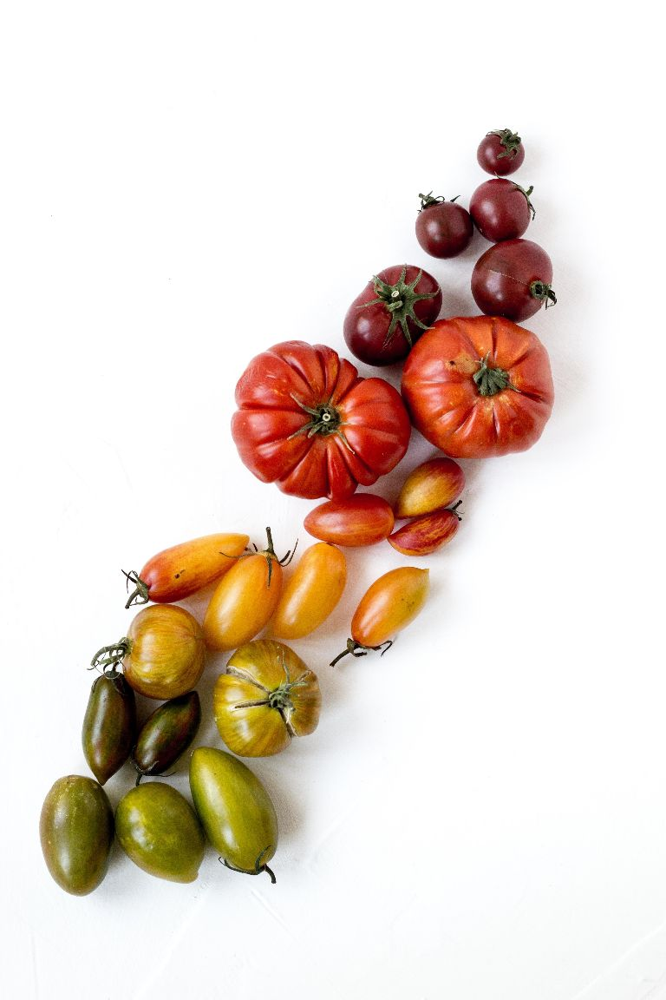

<!DOCTYPE html>
<html lang="en">

<head>
    <meta charset="utf-8">
    <meta name="viewport" content="width=device-width, initial-scale=1.0">
    <link href="https://fonts.googleapis.com/css2?family=Oswald:wght@300;400;700&display=swap" rel="stylesheet">
    <link rel="stylesheet" href="style.css">
    <title>72HealthInfo</title>
</head>

<body>

    <header>
        <h1>72Health.info</h1>
        <ul class="nav-menu">
            <a href="#"><li>Home</li></a>
            <a href="#"><li>About</li></a>
            <a href="#"><li>Menu</li></a>
            <a href="#"><li>Gallery</li></a>
            <a href="#"><li>Contact</li></a>
        </ul>
    </header>
    <section class="about-text">
        <h2>EAT HEALTHY - BE HEALTHY</h2>
        
Eating a healthy diet is not about strict limitations, staying unrealistically thin, or depriving yourself of the foods you love. Rather, it’s about feeling great, having more energy, improving your health, and boosting your mood.    
            Healthy eating doesn’t have to be overly complicated. If you feel overwhelmed by all the conflicting nutrition and diet advice out there, you’re not alone. It seems that for every expert who tells you a certain food is good for you, you’ll find another saying exactly the opposite. The truth is that while some specific foods or nutrients have been shown to have a beneficial effect on mood, it’s your overall dietary pattern that is most important. The cornerstone of a healthy diet should be to replace processed food with real food whenever possible. Eating food that is as close as possible to the way nature made it can make a huge difference to the way you think, look, and feel.    
            By using these simple tips, you can cut through the confusion and learn how to create—and stick to—a tasty, varied, and nutritious diet that is as good for your mind as it is for your body.

        <a href="https://en.wikipedia.org/wiki/Health_food" target="_blank">Read more &raquo;</a>
    </section>
    <section class="show-food">
        

            
            

                <h2>Almonds</h2>
                
The almond (Prunus dulcis, syn. Prunus amygdalus) is a species of tree native to Iran and surrounding countries, but widely cultivated elsewhere. The almond is also the name of the edible and widely cultivated seed of this tree. Within the genus Prunus, it is classified with the peach in the subgenus Amygdalus, distinguished from the other subgenera by corrugations on the shell (endocarp) surrounding the seed. 

            

        

          

            
            

                <h2>Bananas</h2>
                
A banana is an elongated, edible fruit – botanically a berry – produced by several kinds of large herbaceous flowering plants in the genus Musa. In some countries, bananas used for cooking may be called "plantains", distinguishing them from dessert bananas. The fruit is variable in size, color, and firmness, but is usually elongated and curved, with soft flesh rich in starch covered with a rind, which may be green, yellow, red, purple, or brown when ripe. 

            

        

          

            
            

                <h2>Sandwiches</h2>
                
A sandwich is a food typically consisting of vegetables, sliced cheese or meat, placed on or between slices of bread, or more generally any dish wherein bread serves as a container or wrapper for another food type. The sandwich began as a portable finger food in the Western world, though over time it has become prevalent worldwide. The 3rd of November marks the National Sandwich Day. 

            

        

    </section>
    <section class="big-image">
        
    </section>
    <footer>
        
&copy; Seven2Heaven 2020; Done by Milovan Srdanović

    </footer>

</body>

</html>
